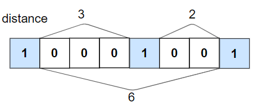

# 1437. Check If All 1's Are at Least Length K Places Away

Difficulty: Easy

https://leetcode.com/problems/check-if-all-1s-are-at-least-length-k-places-away/

Given an array nums of 0s and 1s and an integer k, return True if all 1's are at least k places away from each other, otherwise return False.

**Example 1:**  

```
Input: nums = [1,0,0,0,1,0,0,1], k = 2
Output: true
Explanation: Each of the 1s are at least 2 places away from each other.
```

**Example 2:**  

```
Input: nums = [1,0,0,1,0,1], k = 2
Output: false
Explanation: The second 1 and third 1 are only one apart from each other.
```

**Example 3:**
```
Input: nums = [1,1,1,1,1], k = 0
Output: true
```

**Example 4:**
```
Input: nums = [0,1,0,1], k = 1
Output: true
```

**Constraints:**

* n == hats.length
* 1 <= n <= 10
* 1 <= hats[i].length <= 40
* 1 <= hats[i][j] <= 40
* hats[i] contains a list of unique integers.
