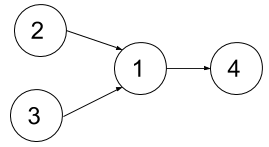

# 1494. Parallel Courses II

Difficulty: Hard

https://leetcode.com/problems/parallel-courses-ii/

You are given an integer n, which indicates that there are n courses labeled from 1 to n. You are also given an array relations where relations[i] = [prevCoursei, nextCoursei], representing a prerequisite relationship between course prevCoursei and course nextCoursei: course prevCoursei has to be taken before course nextCoursei. Also, you are given the integer k.

In one semester, you can take at most k courses as long as you have taken all the prerequisites in the previous semester for the courses you are taking.

Return the minimum number of semesters needed to take all courses. The testcases will be generated such that it is possible to take every course.

**Example 1:**  

```
Input: n = 4, dependencies = [[2,1],[3,1],[1,4]], k = 2
Output: 3 
Explanation: The figure above represents the given graph.
In the first semester, you can take courses 2 and 3.
In the second semester, you can take course 1.
In the third semester, you can take course 4.
```

**Example 2:**  

```
Input: n = 5, dependencies = [[2,1],[3,1],[4,1],[1,5]], k = 2
Output: 4 
Explanation: The figure above represents the given graph.
In the first semester, you can take courses 2 and 3 only since you cannot take more than two per semester.
In the second semester, you can take course 4.
In the third semester, you can take course 1.
In the fourth semester, you can take course 5.
```

**Example 3:**
```
Input: n = 11, dependencies = [], k = 2
Output: 6
```

**Constraints:**

* 1 <= n <= 15
* 1 <= k <= n
* 0 <= relations.length <= n * (n-1) / 2
* relations[i].length == 2
* 1 <= prevCoursei, nextCoursei <= n
* prevCoursei != nextCoursei
* All the pairs [prevCoursei, nextCoursei] are unique.
* The given graph is a directed acyclic graph.
