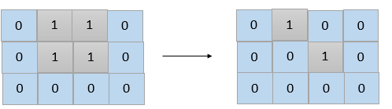

# 1568. Minimum Number of Days to Disconnect Island

Difficulty: Hard

https://leetcode.com/problems/minimum-number-of-days-to-disconnect-island/

Given a 2D grid consisting of 1s (land) and 0s (water).  An island is a maximal 4-directionally (horizontal or vertical) connected group of 1s.

The grid is said to be connected if we have exactly one island, otherwise is said disconnected.

In one day, we are allowed to change any single land cell (1) into a water cell (0).

Return the minimum number of days to disconnect the grid.

**Example 1:**  

```
Input: grid = [[0,1,1,0],[0,1,1,0],[0,0,0,0]]
Output: 2
Explanation: We need at least 2 days to get a disconnected grid.
Change land grid[1][1] and grid[0][2] to water and get 2 disconnected island.
```

**Example 2:**
```
Input: grid = [[1,1]]
Output: 2
Explanation: Grid of full water is also disconnected ([[1,1]] -> [[0,0]]), 0 islands.
```

**Example 3:**
```
Input: grid = [[1,0,1,0]]
Output: 0
```

**Example 4:**
```
Input: grid = [[1,1,0,1,1],
               [1,1,1,1,1],
               [1,1,0,1,1],
               [1,1,0,1,1]]
Output: 1
```

**Example 5:**
```
Input: grid = [[1,1,0,1,1],
               [1,1,1,1,1],
               [1,1,0,1,1],
               [1,1,1,1,1]]
Output: 2
```

**Constraints:**

* 1 <= grid.length, grid[i].length <= 30
* grid[i][j] is 0 or 1.
