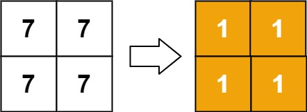

# 1632. Rank Transform of a Matrix

Difficulty: Hard

https://leetcode.com/problems/rank-transform-of-a-matrix/

Given an m x n matrix, return a new matrix answer where answer[row][col] is the rank of matrix[row][col].

The rank is an integer that represents how large an element is compared to other elements. It is calculated using the following rules:

* The rank is an integer starting from 1.
* If two elements p and q are in the same row or column, then:
    * If p < q then rank(p) < rank(q)
    * If p == q then rank(p) == rank(q)
    * If p > q then rank(p) > rank(q)
* The rank should be as small as possible.

It is guaranteed that answer is unique under the given rules.

**Example 1:**  

```
Input: matrix = [[1,2],[3,4]]
Output: [[1,2],[2,3]]
Explanation:
The rank of matrix[0][0] is 1 because it is the smallest integer in its row and column.
The rank of matrix[0][1] is 2 because matrix[0][1] > matrix[0][0] and matrix[0][0] is rank 1.
The rank of matrix[1][0] is 2 because matrix[1][0] > matrix[0][0] and matrix[0][0] is rank 1.
The rank of matrix[1][1] is 3 because matrix[1][1] > matrix[0][1], matrix[1][1] > matrix[1][0], and both matrix[0][1] and matrix[1][0] are rank 2.
```

**Example 2:**  

```
Input: matrix = [[7,7],[7,7]]
Output: [[1,1],[1,1]]
```

**Example 3:**  

```
Input: matrix = [[20,-21,14],[-19,4,19],[22,-47,24],[-19,4,19]]
Output: [[4,2,3],[1,3,4],[5,1,6],[1,3,4]]
```

**Example 4:**  

```
Input: matrix = [[7,3,6],[1,4,5],[9,8,2]]
Output: [[5,1,4],[1,2,3],[6,3,1]]
```

**Constraints:**

* m == matrix.length
* n == matrix[i].length
* 1 <= m, n <= 500
* -10<sup>9</sup> <= matrix[row][col] <= 10<sup>9</sup>
