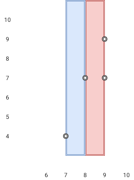

# 1637. Widest Vertical Area Between Two Points Containing No Points

Difficulty: Medium

https://leetcode.com/problems/widest-vertical-area-between-two-points-containing-no-points/

Given n points on a 2D plane where points[i] = [xi, yi], Return the widest vertical area between two points such that no points are inside the area.

A vertical area is an area of fixed-width extending infinitely along the y-axis (i.e., infinite height). The widest vertical area is the one with the maximum width.

Note that points on the edge of a vertical area are not considered included in the area.

**Example 1:**  

```
Input: points = [[8,7],[9,9],[7,4],[9,7]]
Output: 1
Explanation: Both the red and the blue area are optimal.
```

**Example 2:**
```
Input: points = [[3,1],[9,0],[1,0],[1,4],[5,3],[8,8]]
Output: 3
```

**Constraints:**

* n == points.length
* 2 <= n <= 10<sup>5</sup>
* points[i].length == 2
* 0 <= xi, yi <= 10<sup>9</sup>
