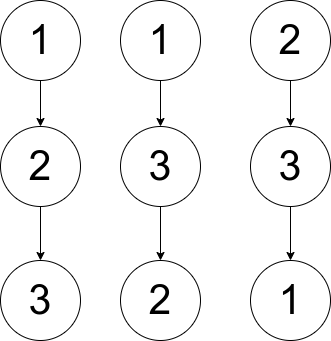

# 1719. Number Of Ways To Reconstruct A Tree

Difficulty: Hard

https://leetcode.com/problems/number-of-ways-to-reconstruct-a-tree/

You are given an array pairs, where pairs[i] = [xi, yi], and:

* There are no duplicates.
* xi < yi

Let ways be the number of rooted trees that satisfy the following conditions:

* The tree consists of nodes whose values appeared in pairs.
* A pair [xi, yi] exists in pairs if and only if xi is an ancestor of yi or yi is an ancestor of xi.
* Note: the tree does not have to be a binary tree.

Two ways are considered to be different if there is at least one node that has different parents in both ways.

Return:

* 0 if ways == 0
* 1 if ways == 1
* 2 if ways > 1

A rooted tree is a tree that has a single root node, and all edges are oriented to be outgoing from the root.

An ancestor of a node is any node on the path from the root to that node (excluding the node itself). The root has no ancestors.

**Example 1:**  

```
Input: pairs = [[1,2],[2,3]]
Output: 1
Explanation: There is exactly one valid rooted tree, which is shown in the above figure.
```

**Example 2:**  

```
Input: pairs = [[1,2],[2,3],[1,3]]
Output: 2
Explanation: There are multiple valid rooted trees. Three of them are shown in the above figures.
```

**Example 3:**
```
Input: pairs = [[1,2],[2,3],[2,4],[1,5]]
Output: 0
Explanation: There are no valid rooted trees.
```

**Constraints:**

* 1 <= pairs.length <= 10<sup>5</sup>
* 1 <= xi < yi <= 500
* The elements in pairs are unique.
