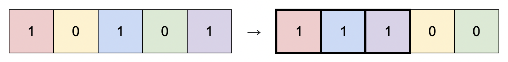

# 1727.Largest Submatrix With Rearrangements

Difficulty: Medium

https://leetcode.com/problems/largest-submatrix-with-rearrangements/

You are given a binary matrix matrix of size m x n, and you are allowed to rearrange the columns of the matrix in any order.

Return the area of the largest submatrix within matrix where every element of the submatrix is 1 after reordering the columns optimally.

**Example 1:**  

```
Input: matrix = [[0,0,1],[1,1,1],[1,0,1]]
Output: 4
Explanation: You can rearrange the columns as shown above.
The largest submatrix of 1s, in bold, has an area of 4.
```

**Example 2:**  

```
Input: matrix = [[1,0,1,0,1]]
Output: 3
Explanation: You can rearrange the columns as shown above.
The largest submatrix of 1s, in bold, has an area of 3.
```

**Example 3:**
```
Input: matrix = [[1,1,0],[1,0,1]]
Output: 2
Explanation: Notice that you must rearrange entire columns, and there is no way to make a submatrix of 1s larger than an area of 2.
```

**Example 4:**
```
Input: matrix = [[0,0],[0,0]]
Output: 0
Explanation: As there are no 1s, no submatrix of 1s can be formed and the area is 0.
```

**Constraints:**

* m == matrix.length
* n == matrix[i].length
* 1 <= m * n <= 10<sup>5</sup>
* matrix[i][j] is 0 or 1.
